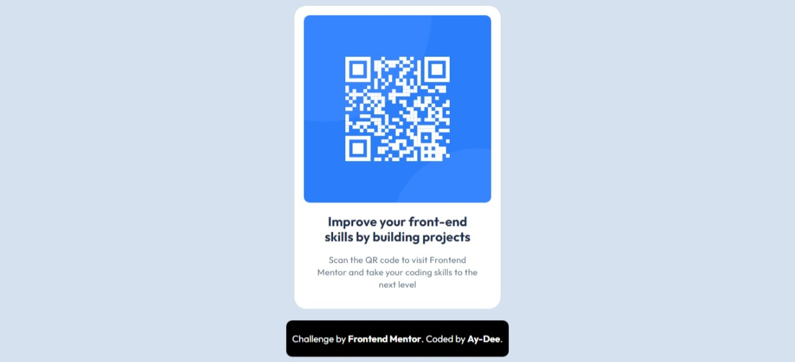

# Frontend Mentor - QR code component solution

This is a solution to the [QR code component challenge on Frontend Mentor](https://www.frontendmentor.io/challenges/qr-code-component-iux_sIO_H). Frontend Mentor challenges help you improve your coding skills by building realistic projects. 

## Table of contents

- [Overview](#overview)
  - [Screenshot](#screenshot)
  - [Links](#links)
- [My process](#my-process)
  - [Built with](#built-with)
  - [What I learned](#what-i-learned)
  - [Continued development](#continued-development)
  - [Useful resources](#useful-resources)
- [Author](#author)
- [Acknowledgments](#acknowledgments)

## Overview

### Screenshot



### Links

- Solution URL: [Add solution URL here](https://www.frontendmentor.io/solutions/qr-code-component-using-htmlcss-olXjzO3Jzq)
- Live Site URL: [Frontend Mentor | QR code component](https://aydee-qrcodecomponent.com)

### Built with

- Semantic HTML5 markup
- CSS custom properties
- Flexbox
- Desktop-first workflow

### What I learned
I learnt how to import variable font files into a project for the first time
```css
@font-face {
    font-family: 'Outfit';
    src: url(font/Outfit/Outfit-VariableFont_wght.ttf) format('truetype-variations');
    font-weight: 100 900;
}
```

### Continued development

To be honest CSS is not my strong suit currently but, i can't wait to try out more CSS rules in the forthcoming Frontend Mentor projects. I took quite a while on this project (about 4 hrs) and i would love to do better next time

### Useful resources

- [StackOverflow](https://www.stackoverflow.com) - This was were i got my answer to how i would import a variable font file.

## Author

- Website - [Still working on it]()
- Frontend Mentor - [@Ay-Dee](https://www.frontendmentor.io/profile/yourusername)
- Twitter - [@lazycodegenius](https://www.twitter.com/lazycodegenius)

## Acknowledgments

I would love to acknowledge myself for seeing this through
